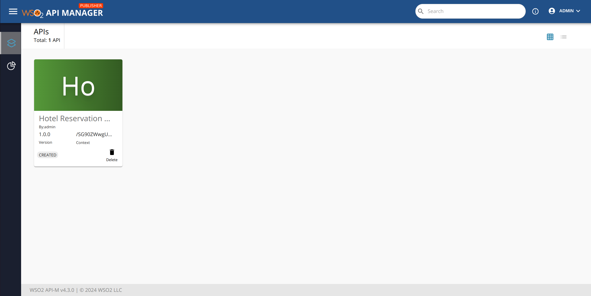
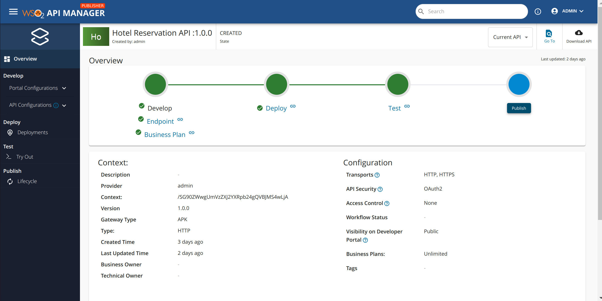
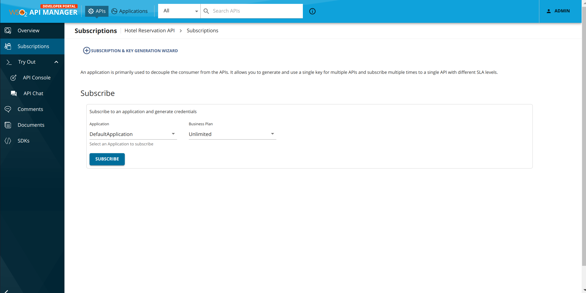
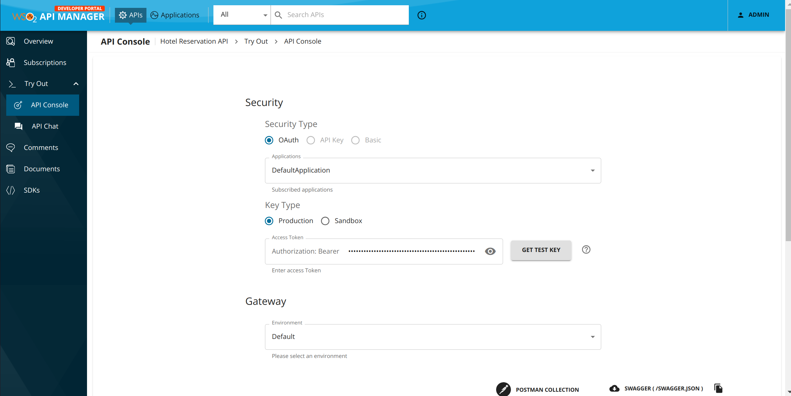
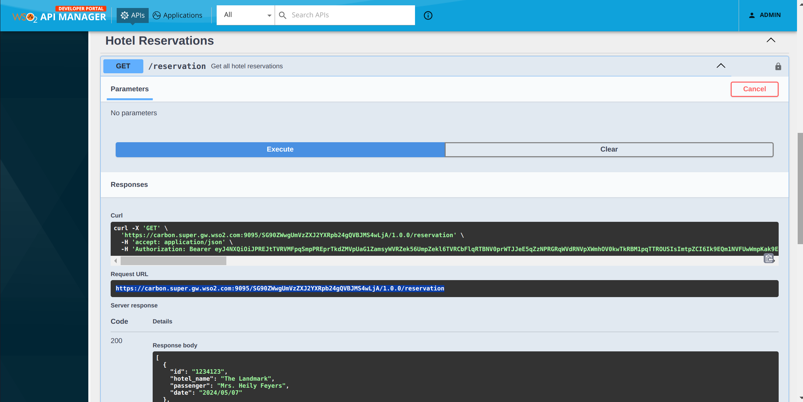

# Prerequisites

1. [Setup a Kubernetes Cluster](https://kubernetes.io/docs/setup).
2. [Install the Kubernetes Client (kubectl)](https://kubernetes.io/docs/tasks/tools/install-kubectl/).
3. [Install Helm](https://helm.sh/docs/intro/install/).

To successfully deploy WSO2 APK in your environment, it's essential to meet certain minimum requirements. These requirements ensure that the deployment process is smooth, and the platform operates efficiently.

To check the minimun requirement according to your setup follow [Minimum Requirement](https://apk.docs.wso2.com/en/latest/setup/prerequisites/).

# Install APK With Control Plane

Please follow guide to installing an APK with Control Plane [Setup](https://apk.docs.wso2.com/en/latest/setup/install-with-cp/)

# API Development Flow

[](resources/demo.png)

## Step 1 - Create the Backend

Prior to invoking the API, you will need to have this backend up. 

We have provided the file containing this sample backend [here](/resources/backend.yaml). Download it and create the backend service using the following command.

```
kubectl apply -f backend.yaml -n backend
```

Wait for this pod to spin up. You can check its status using the following command.

```
kubectl get pods -n backend
```

## Step 2 - Access thorugh localhost

1. To access the deployment through your local machine"

    Port forward gateway service to localhost.
        ```console
        kubectl port-forward svc/apk-wso2-apk-gateway-service 9095:9095
        ```

2. Add a hostname mapping to the ```/etc/hosts``` file as follows.

    | IP        | Domain name         |
    | --------- | ------------------- |
    | 127.0.0.1 | api.am.wso2.com default.gw.wso2.com idp.am.wso2.com carbon.super.gw.wso2.com  |

## Step 3 - Generate APK configuration file from the OpenAPI definition

1. Save and download the sample [HotelReservationService.json](resources/HotelReservationService) file. This is the OAS definition of the API that we are going to deploy in APK.

Apart from the above API definition file, we also need an `apk-conf` file that defines the configurations and metadata for this API. We have a configuration service that can be used to generate this apk-conf file when the OpenAPI definition is provided. 


2. Execute the following request to generate the apk configuration.


```
curl -k --location 'https://api.am.wso2.com:9095/api/configurator/1.1.0/apis/generate-configuration' --header 'Host: api.am.wso2.com' --form 'definition=@"./HotelReservationService.json"'
```

3. Following response coming from config genarator service.
```
---
name: "Hotel Reservation API"
basePath: "/SG90ZWwgUmVzZXJ2YXRpb24gQVBJMS4wLjA"
version: "1.0.0"
type: "REST"
defaultVersion: false
subscriptionValidation: false
endpointConfigurations:
    production:
        endpoint: "http://hotel-service.backend:82"
operations:
- target: "/reservation"
    verb: "GET"
    secured: true
    scopes: []
- target: "/reservation"
    verb: "POST"
    secured: true
    scopes: []
- target: "/reservation/{id}"
    verb: "PUT"
    secured: true
    scopes: []
- target: "/reservation/{id}"
    verb: "DELETE"
    secured: true
    scopes: []
```


4. You will get the apk-conf file content as the response. Save this content into a file named `HotelReservation.apk-conf`.

## Step 4 - Generate K8s custom resources and Deploy

By invoking the Configuration Service, you can generate Kubernetes artifacts specifically tailored for APIs. These artifacts can be applied to a Kubernetes cluster using standard command-line tools like kubectl. 

```
curl --location 'https://api.am.wso2.com:9095/api/configurator/1.0.0/apis/generate-k8s-resources' \
--header 'Content-Type: multipart/form-data' \
--header 'Accept: application/zip' \
--form 'apkConfiguration=@"/Users/user/EmployeeService.apk-conf"' \
--form 'definitionFile=@"/Users/user/EmployeeServiceDefinition.json"' \
-k --output ./api-crds.zip
```

The sample output of the generated zip file looks as follows.

```
├── 7416c241a121b844392d447f00ff6709cb9c932b.yaml
├── 7416c241a121b844392d447f00ff6709cb9c932b-definition.yaml.yaml
├── 7416c241a121b844392d447f00ff6709cb9c932b-production-httproute-1.yaml
└── backend-f3d6786c4f383ffbd7ec8620596811df652dba73-api.yaml
```
Once you have generated your K8s artifacts, the next step is to apply them to the Kubernetes API server. 

    
    kubectl apply -f <path_to_extracted_zip_file> -n apk
    

4. Execute the command below. You will be able to see that the `EmployeeServiceAPI` is successfully deployed as shown in the image.

    ```
    kubectl get apis -n apk
    ```


# Manage API From Control Plane¶

Publisher URL - https://am.wso2.com/publisher
Devportal URL - https://am.wso2.com/devportal


Login to the Publisher Console (https://am.wso2.com/publisher) of the APK Control Plane.

you can see the deploy Hotel reservation API as below.

[](resources/api.png)

Go into the API and publish API.

[](resources/publish.png)


Go to developer portal and you can see the API There.
Then go to subscription and subcribe to the API.

[](resources/subscribe.png)

Tryout API
Go to tryout console and generate a production token with test token button.

[](resources/tokenGen.png)


Finally Invoke API

[](resources/invoke.png)


